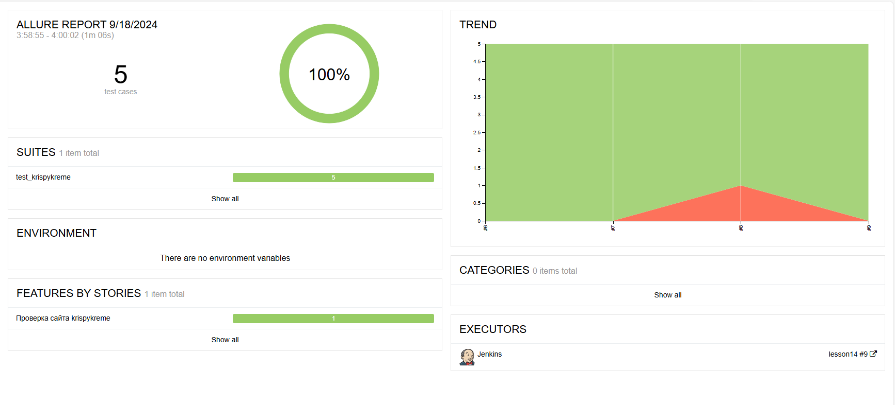
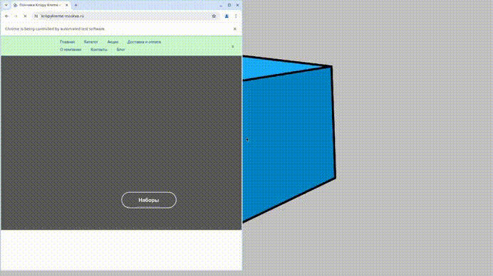
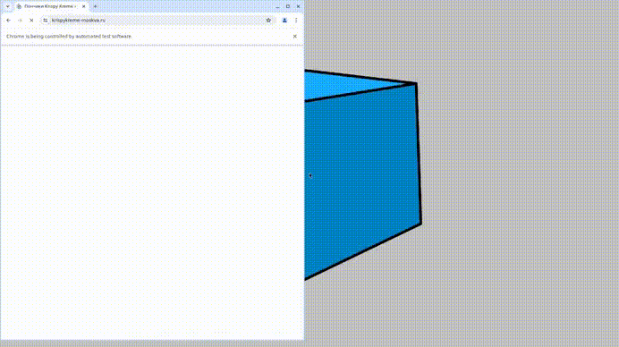
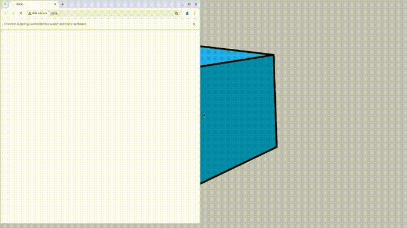
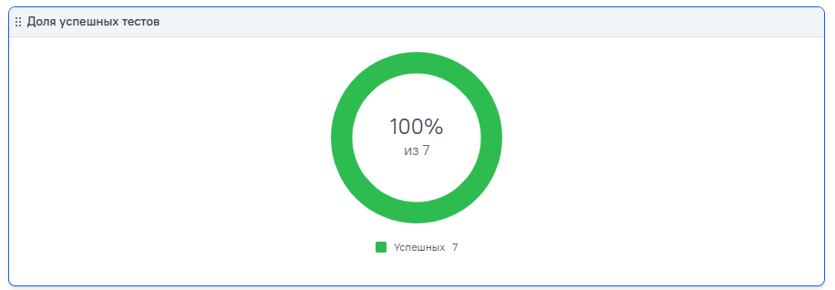
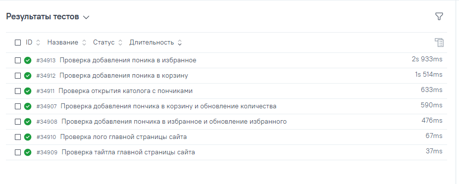

Автоматизация тестирования сайта Krispy Kreme
=====================
Этот проект автоматизирует тестирование функциональности сайта Krispy Kreme Москва, уделяя внимание таким элементам, как навигация по страницам, видимость логотипа, добавление продуктов в корзину и в избранное. Для браузерной автоматизации используется фреймворк `Selene`, а для логирования шагов и отчетности — `Allure`.
***
## Тестируемые функции
1. **Проверка тайтла главной страницы**: Проверка корректного открытия главной страницы сайта.
2. **Проверка логотипа на главной странице**: Подтверждение видимости логотипа Krispy Kreme.
3. **Открытие каталога пончиков**: Убедиться, что страница каталога пончиков открывается.
4. **Добавление продукта в корзину**: Проверка, что продукт успешно добавляется в корзину.
5. **Обновление количества пончика в корзине**: Тестирование изменения количества товара в корзине.
5. **Добавление продукта в избранное**: Проверка, что продукт успешно добавляется в список избранного.
***
## Технологии
- **Язык**: `Python`
- **Фреймворк для тестов**: `pytest`, `Selene`
- **Отчетность**: `Allure`
- **Система управления браузерами**: `Selenoid`
- **Уведомления о прохождении тестов**: `Allure TestOps`
- **Вид тестов**: `web`, `api`
***
## Результаты теста
### Allure-отчет
#### Главная страница Allure-отчета

#### Видео теста: Проверка тайтла главной страницы

#### Видео теста: Проверка логотипа на главной странице

#### Видео теста: Открытие каталога пончиков

#### Видео теста: Добавление продукта в корзину

#### Видео теста: Добавление продукта в избранное

### Результат прохождения тестов в TestOps

